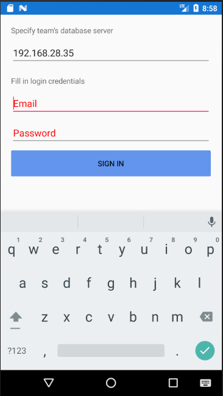
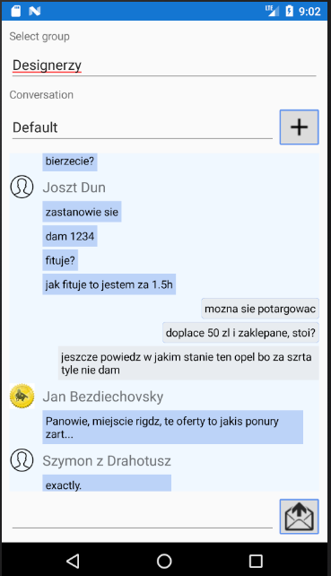
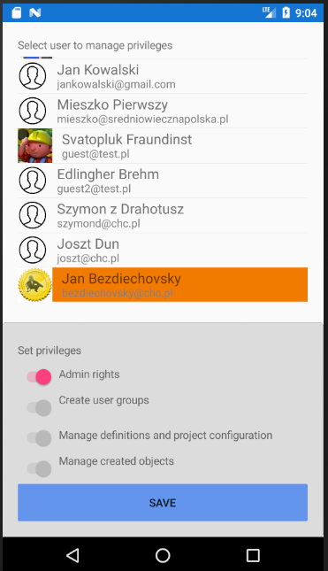

# GRWO Mobile

Platforma | wersja API | stack | język
-|-|-|-
Android | 24 | Xamarin.Forms / .NET Core | C# 7.3

Aplikacja realizuje wycinek wybranych funkcjonalności odziedziczonych po wersji desktop (WPF). 
Zapewnia komunikację tekstową członkom zespołu z podziałem na konwersacje.
Członkowie z uprawnieniami administracyjnymi (zarządzanie użytkownikami) mogą dodatkowo zmieniać prawa członków zespołu.

## Wybrane funkcjonalności

### Strona logowania do aplikacji
Aplikacja wykorzystuje serwer MS SQL zarządzany przez zespół. 
Dla każdego realizowanego przez zespół projektu jest generowana oddzielna baza danych.

### Strona czatu
Dostępni uczestnicy konwersacji zależą od wybranej grupy użytkowników. 
Każda grupa ma domyślny czat, zawierający wszystkich użytkowników.

### Strona przydziału uprawnień
W tym przypadku dostęp do strony mają tylko użytkownicy z uprawnieniem.
Uprawienie administratora jest absolutne i zawiera w sobie wszystkie.

